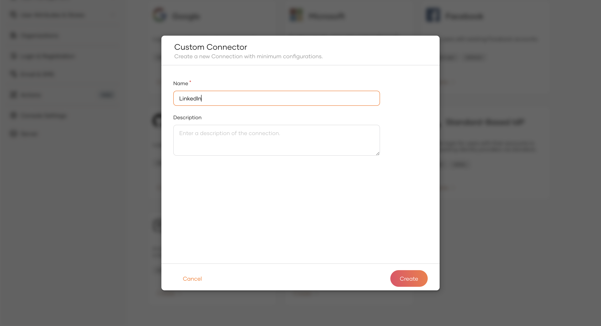
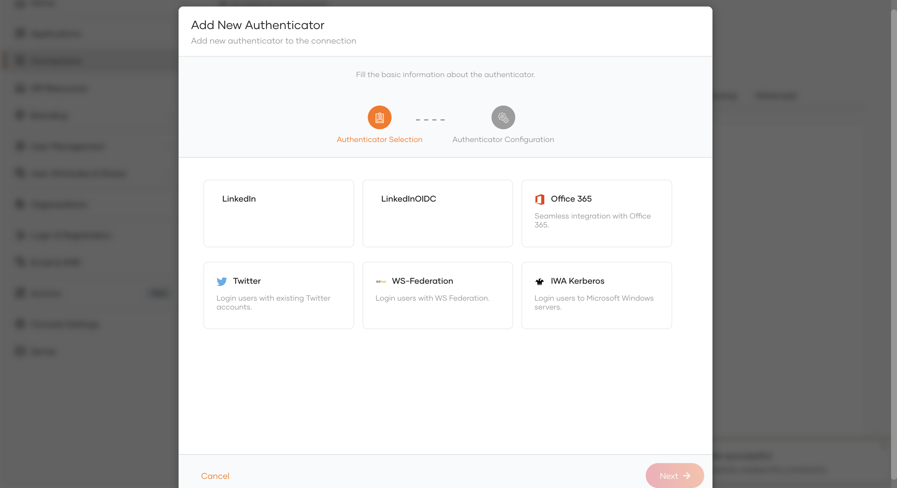
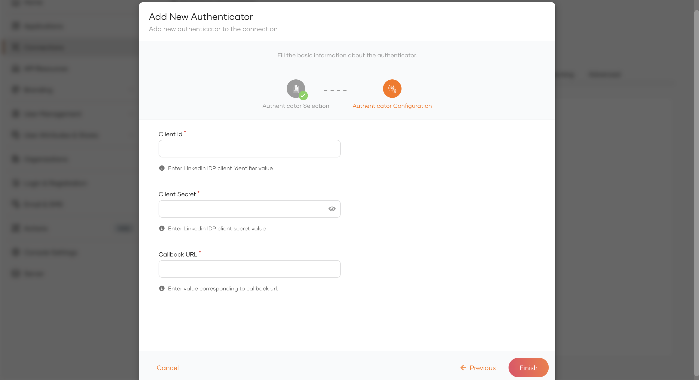
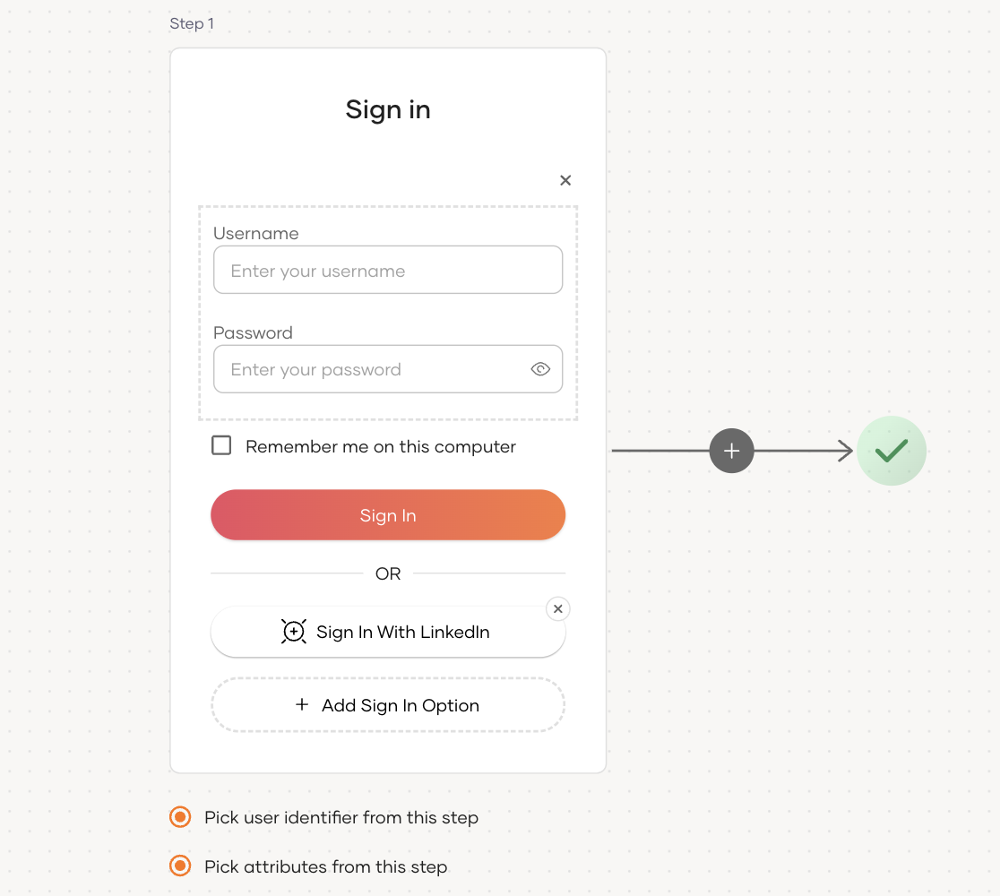
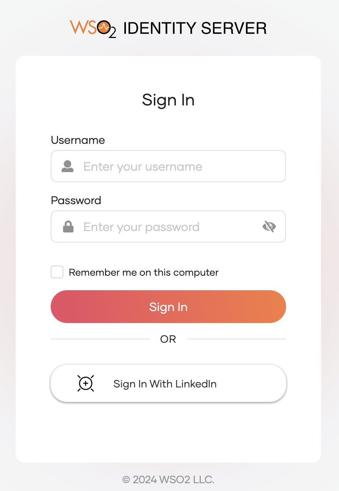

# Configuring LinkedIn Authenticator In Identity Server (7.0.0 Onwards)

This guide provides instructions on how to configure the LinkedIn authenticator and add LinkedIn login to your applications using WSO2 Identity Server, enabling users to log in with their LinkedIn accounts.

Follow the steps given below to set this up.

## Configure the LinkedIn Authenticator

1. Download the .jar file from the [WSO2 Store](https://store.wso2.com/connector/identity-outbound-auth-linkedIn)
    - **OAuth 2.0** : `org.wso2.carbon.extension.identity.authenticator.linkedin.connector-x.x.x` 
    - **OpenID Connect (V2)** : `org.wso2.carbon.extension.identity.authenticator.linkedin.oidc.connector-x.x.x`
2. Place the authenticator.jar file into the 
`<IS_HOME>/repository/components/dropins` directory. 

3. Start or restart the WSO2 Identity Server. 

> If you want to upgrade the LinkedIn (.jar) in your existing Identity Server pack, please refer [upgrade instructions](https://docs.wso2.com/display/ISCONNECTORS/Upgrading+an+Authenticator).

## Register WSO2 Identity Server on LinkedIn

1. Navigate to LinkedIn [Create an app page](https://www.linkedin.com/developer/apps/new).

2. Enter the required details.
    * App Name and Company details. The company should have a LinkedIn page.
    * Upload an image that you wish to use as the company logo.
    * Select the checkbox to agree to the LinkedIn terms and conditions.
3. Click on **Create App**. You will be redirect to a page with **Settings** for the created application. 

4. Navigate to the **Auth** tab where you can see the **Client ID** and
    **Client Secret**.
    
5. Enter the **Redirect URL** under the **OAuth 2.0 settings** as the following format and click on **Update
**. `https://{hostname}:{port}/commonauth`. The default redirect URL in WSO2 Identity Server is `https
://localhost:9443/commonauth`.

6. Copy the **Client ID** and **Client Secret** from the resulting page.

## Register the LinkedIn IdP

Next, let's register the LinkedIn IdP in WSO2 Identity Server.

1. On the WSO2 Identity Server Console, go to **Connections**.

2. Click **Create Connection** and select Custom Connector.

3. Enter a unique name and a description and click Create.

4. Go to **Settings** tab and click **New Authenticator**.

5. Select the **LinkedIn** (OAuth 2.0) / **LinkedInOIDC** (OpenID Connect) authenticator you want to add and click Next.

6. Enter the requested details of the authenticator and click Finish.

<table>
<thead>
<tr class="header">
<th>Parameter</th>
<th>Description</th>
</tr>
</thead>
<tbody>
<tr class="odd">
<td>Client Id</td>
<td>The client ID obtained from LinkedIn app.</td>
</tr>
<tr class="odd">
<td>Client Secret</td>
<td>The client secret obtained from LinkedIn app.</td>
</tr>
<tr class="odd">
<td>Callback URL</td>
<td>This is the URL to which the browser should be redirected after the authentication is successful. 
It should have this format: https://(host-name):(port)/commonauth</td>
</tr>
</tbody>
</table>

## Enable LinkedIn login

> You need to [register an application with WSO2 Identity Server](https://is.docs.wso2.com/en/latest/guides/applications/). You can register your own application or use one of the [sample applications](https://is.docs.wso2.com/en/latest/get-started/try-samples/) provided.

1. On the WSO2 Identity Server Console, go to **Applications**.
2. Select your application, go to the Login Flow tab and add LinkedIn login from your preferred editor:
  
    a. Click Add Sign In Option to add a new authenticator to the first step.

    b. Select the LinkedIn connection.

    c. Click Confirm to add login with LinkedIn to the sign-in flow.

    

3. Click Update to save your changes.

## Try it out

Follow the steps given below.

1. Access the application URL.

2. Click Login to open the WSO2 Identity Server login page.

3. On the WSO2 Identity Server login page, Sign in with LinkedIn.

 

4. Log in to LinkedIn with an existing user account.
